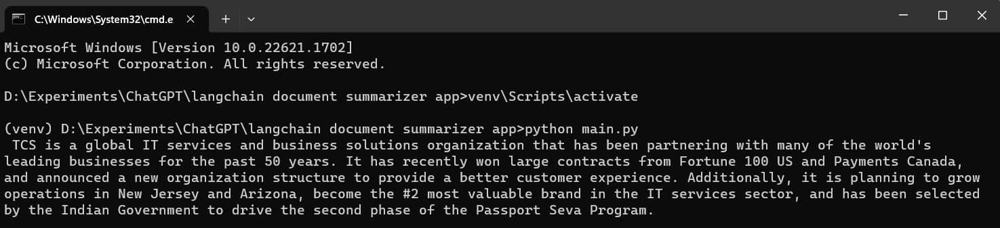

# LangChain powered PDF summarizer app
This app is an LangChain powered PDF summarizer using Gradio.

## Demos




## Run the app
- Install the dependencies
```
pip install -r requirements.txt
```
or
```
pip install langchain openai gradio pypdf tiktoken
```
- Run the `app.py` using the following command
```
python main.py
``` 

## How to Get OpenAI key ?
- Openai key is required to access langchain. Follow the steps to create a new openai key.
- Open platform.openai.com.
- Click on your name or icon option which is located on the top right corner of the page and select "API Keys" or click on the link - Account API Keys - OpenAI API.
- Click on create new secret key button to create a new openai key.